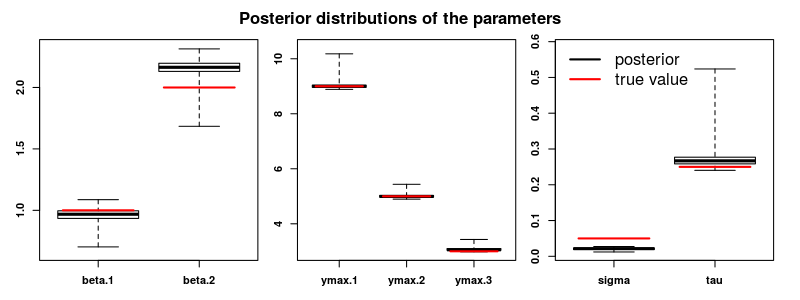
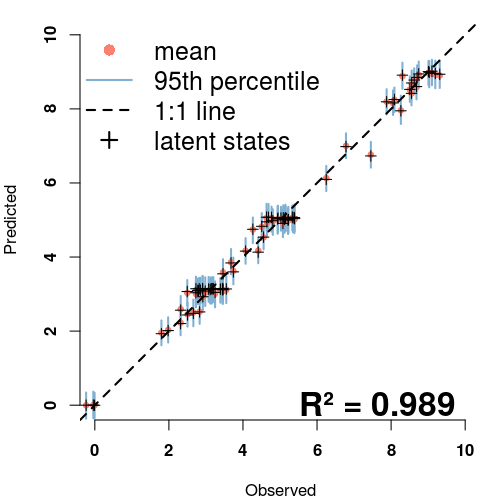

# Getting started with phenoCDM
Continuous development models for incremental time-series analysis: applications on leaf phenology


## Installation
The latest stable version of the phenoCDM package can be directly installed from the The Comprehensive R Archive Network, [CRAN](https://cran.r-project.org/):

```{r, echo=TRUE, eval = FALSE}

install.packages("phenoCDM")

```

The latest beta release of the package can be directly installed from the GitHub repository:

```{r, echo=TRUE, eval = FALSE}

if(!require(devtools)) install.packages("devtools")

install_github(repo = 'bnasr/phenoCDM')

```


## Loading the package
The package can be loaded in an R environment as:

```{r, echo=TRUE, eval = FALSE}

library(phenoCDM)

```


## Example
Here, to show how the package works, we generate a simulated dataset with know parameters and then fit the state-space model to find the parameters. A comparison will illustrate model reliability in estimating the true values.

The following sections we show how to use the main functions.


### Simulating a dataset of three time-series:
We are simulating 3 time-series of length 30, and these "true" values: the maximum response values (ymax) of 9, 5 and 3, the coefficients (beta) of 1 and 2, the process error (sigma) of 0.05, and the observation error of 0.25. The data contain 10% of missing values.

```{r, echo=TRUE, eval = FALSE}

set.seed(2)

ssSim <- phenoSim(nSites = 3, #number of sites
                  nTSet = 30, #number of time steps
                  beta = c(1, 2), #beta coefficients
                  sig = 0.05, #process error
                  tau = 0.25, #observation error
                  plotFlag = F, #whether plot the data or not
                  miss = 0.1, #portion of missing data
                  ymax = c(9,5, 3) #maximum of saturation trajectory
)


```

The simulated dataset is now stored in the 'ssSim' variable as a list of predictors (ssSim$x), response (ssSim$z) and the connectivity matrix (ssSim$connect). The connectivity matrix has two columns for each observed response. The first and second columns indicate whether the corresponding observation is connected to the last and next observations in time, respectively.

### Plotting the simulated time-series:
The time series is plotted below:

```{r, echo=TRUE, eval = FALSE}


ww1 <- which(is.na( ssSim$connect[,1]))
ww2 <- which(is.na( ssSim$connect[,2]))

png('fig1.png', width = 6, height = 3, units = 'in', res = 300)

par(mfrow = c(1,3), oma = c(4,4,4,3), mar=c(0,1,0,0))
for(i in 1:length(ww1))  {
  z <- ssSim$z[ww1[i]:ww2[i]]
  ymax <- ssSim$ymax[i]
  plot(z, xlab = 'Index', ylab = '', type = 'b', ylim = range(c(0, ymax, ssSim$z), na.rm = T), yaxt= switch(i, '1'='s', '2'='n', '3' = 'n'))
  mtext(paste('Set', i), side = 3, line = .3, col = 'blue', font=1)
  abline(h = ymax, col='red')
}

mtext(text = 'Response (z)', side = 2, line = 2, outer = T, font = 2)
mtext(text = 'Index', side = 1, line = 2.5, outer = T, font = 2)
mtext('Simulated time-series data', side = 3, outer = T, line = 1.5, font = 2)
legend('bottomright', legend = c('z', 'ymax'), col = c('black', 'red'), lty = 1, bty = 'n', cex=1.5, lwd =2)

dev.off()

```


### Fitting the CDM model on the simulated data:
The model can be fitted on the simulated data  by the "fitCDM" function.

```{r, echo=TRUE, eval = FALSE}

ssOut <- fitCDM(x = ssSim$x, #predictors
                nGibbs = 2000,
                nBurnin = 1000,
                z = ssSim$z,#response
                connect = ssSim$connect, #connectivity of time data
                quiet=T,
                calcLatentGibbs = T)
```


### Obtaining the summarized output:
The fitted model returns the chains from the Gibbs sampling for each parameter. We can perform simple statistics to check mean value and different quantiles.

```{r, echo=TRUE, eval = FALSE}

summ <- getGibbsSummary(ssOut, burnin = 1000, sigmaPerSeason = F)

colMeans(summ$ymax)
colMeans(summ$betas)
colMeans(summ$tau)
colMeans(summ$sigma)

```


### Comparing the model fitted parameters against true values:
The model shows a strong reliability for estimating the parameteres.

```{r, echo=TRUE, eval = FALSE}

png('fig2.png', width = 8, height = 3, units = 'in', res = 300)
par(mfrow = c(1,3), oma = c(1,1,3,1), mar=c(2,2,0,1), font.axis=2)

plotPost(chains = ssOut$chains[,c("beta.1", "beta.2")], trueValues = ssSim$beta)
plotPost(chains = ssOut$chains[,c("ymax.1", "ymax.2", "ymax.3")], trueValues = ssSim$ymax)
plotPost(chains = ssOut$chains[,c("sigma", "tau")], trueValues = c(ssSim$sig, ssSim$tau))
mtext('Posterior distributions of the parameters', side = 3, outer = T, line = 1, font = 2)
legend('topleft', legend = c('posterior', 'true value'), col = c('black', 'red'), lty = 1, bty = 'n', cex=1.5, lwd =2)

dev.off()

```




### Comparing the model predictions of the response vector against the observations:
The predicted timeseries also matches the original observations pretty well.

```{r, echo=TRUE, eval = FALSE}


yGibbs <- ssOut$latentGibbs
zGibbs <- ssOut$zpred
o <- ssOut$data$z
p <- apply(ssOut$rawsamples$y, 1, mean)
R2 <- cor(na.omit(cbind(o, p)))[1,2]^2

png('fig3.png', width = 5, height = 5, units = 'in', res = 300)
par( mar=c(4,4,1,1), font.axis=2)
plotPOGibbs(o = o , p = zGibbs,
            xlim = c(0,10), ylim=c(0,10),
            cex = .7, nburnin = 1000)
points(o, p, pch = 3)
mtext(paste0('R² = ', signif(R2, 3)), line = -1, cex = 2, font = 2, side = 1, adj = .9)
legend('topleft', legend = c('mean', '95th percentile', '1:1 line', 'latent states'),
       col = c('#fb8072','#80b1d3','black', 'black'),
       bty = 'n', cex=1.5,
       lty = c(NA, 1, 2, NA), lwd =c(NA, 2, 2, 2), pch = c(16, NA, NA, 3))
dev.off()


```



### Documentations 
Help pages are available for each functions inside an R environment using for example:

```{r, echo=TRUE, eval = FALSE}

?phenoCDM::fitCDM

```


